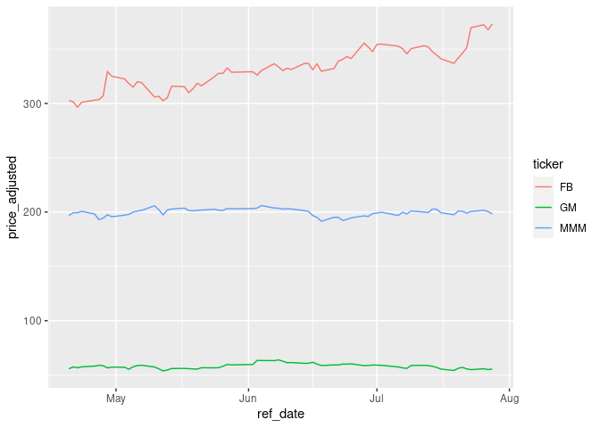
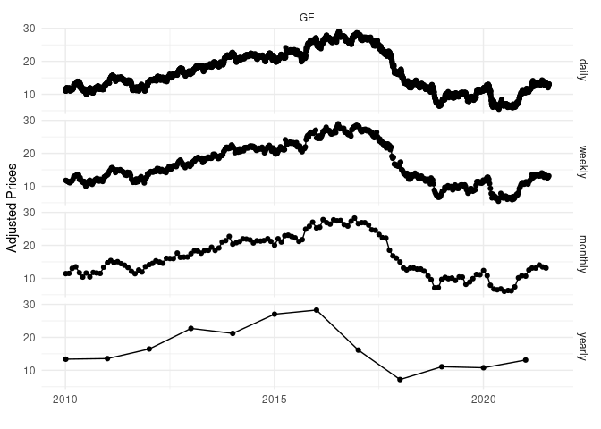

<!-- README.md is generated from README.Rmd. Please edit that file -->
<!-- badges: start -->

[](https://www.repostatus.org/#active)
[](https://app.codecov.io/gh/msperlin/yfR?branch=main)
[](https://github.com/msperlin/yfR/actions)
[](https://github.com/ropensci/software-review/issues/523)
<!-- badges: end -->

# Motivation

`yfR` facilitates importing stock prices from Yahoo finance, organizing
the data in the `tidy` format and speeding up the process using a cache
system and parallel computing. `yfR` is the second and
backwards-incompatible version of
[BatchGetSymbols](https://CRAN.R-project.org/package=BatchGetSymbols),
released in 2016 (see vignette “99-yfR and BatchGetSymbols”).

In a nutshell, [Yahoo Finance](https://finance.yahoo.com/) provides a
vast repository of stock price data around the globe. It cover a
signficant number of markets and assets, being used extensively in
academic research and teaching. In order to import the financial data,
all you need is a ticker (id of a stock, e.g. “GM” for [General
Motors](https://finance.yahoo.com/quote/GM?p=GM&.tsrc=fin-srch)) and a
time period (first and last date).

# The Data

The main function of the package, `yfR::yf_get`, returns a dataframe
with the financial data. All price data is measured at the unit of the
financial exchange. For example, price data for FB (NYSE/US) is measures
in dollars, while price data for PETR3.SA (B3/BR) is measured in Reais
(Brazilian currency).

The return dataframe contains the following columns:

ticker  
The requested tickers (ids of stocks)

ref_date  
The reference day (this can also be year/month/week when using argument
freq_data)

price_open  
The opening price of the day/period

price_high  
The highest price of the day/period

price_close  
The close/last price of the day/period

volume  
The financial volume of the day/period

price_adjusted  
The stock price adjusted for corporate events such as splits, dividends
and others – this is usually what you want/need for studying stocks as
it represents the actual financial performance of stockholders

ret_adjusted_prices  
The arithmetic or log return (see input type_return) for the adjusted
stock prices

ret_adjusted_prices  
The arithmetic or log return (see input type_return) for the closing
stock prices

cumret_adjusted_prices  
The accumulated arithmetic/log return for the period (starts at 100%)

# Finding tickers

The easiest way to find the tickers of a company stock is to search for
it in [Yahoo Finance’s](https://finance.yahoo.com/) website. At the top
page you’ll find a search bar:


From there, you’ll that a company can have many different stocks traded
at different markets. As the example shows, Petrobras is traded at NYQ
(New York Exchange), SAO (Sao Paulo/Brazil - B3 exchange) and BUE
(Buenos Aires/Argentina Exchange), all with different symbols (tickers).

## Features of `yfR`

-   Fetchs daily/weekly/monthly/annual stock prices/returns from yahoo
    finance and outputs a dataframe (tibble) in the long format (stacked
    data);

-   A new feature called “collections” facilitates download of multiple
    tickers from a particular market/index. You can, for example,
    download data for all stocks in the SP500 index with a simple call
    to `yf_collection_get()`;

-   A session-persistent smart cache system is available by default.
    This means that the data is saved locally and only missing portions
    are downloaded, if needed.

-   All dates are compared to a benchmark ticker such as SP500 and,
    whenever an individual asset does not have a sufficient number of
    dates, the software drops it from the output. This means you can
    choose to ignore tickers with high number of missing dates.

-   A customized function called `yf_convert_to_wide()` can transform
    the long dataframe into a wide format (tickers as columns), much
    used in portfolio optimization. The output is a list where each
    element is a different target variable (prices, returns, volumes).

-   Parallel computing with package `furrr` is available, speeding up
    the data importation process.

## Warnings

-   Yahoo finance data is far from perfect or reliable, specially for
    individual stocks. In my experience, using it for research code with
    stock **indices** is fine and I can match it with other data
    sources. But, adjusted stock prices for **individual assets** is
    messy as stock events such as splits or dividends are not properly
    registered. I was never able to match it with other data sources,
    specially for long time periods with lots of corporate events. My
    advice is to **never use the yahoo finance data of individual stocks
    in production** (research papers or academic documents – thesis and
    dissertations). If adjusted price data of individual stocks is
    important for your research, **use other data sources** such as
    [EOD](https://eodhistoricaldata.com/), [SimFin](https://simfin.com/)
    or [Economática](https://economatica.com/).

## Installation

    # CRAN (not yet available)
    #install.packages('yfR')

    # Github (dev version)
    devtools::install_github('msperlin/yfR')

## A simple example of usage

``` r
library(yfR)

# set options for algorithm
my_ticker <- 'FB'
first_date <- Sys.Date() - 30
last_date <- Sys.Date()

# fetch data
df_yf <- yf_get(tickers = my_ticker, 
                     first_date = first_date,
                     last_date = last_date)
#> 
#> ── Running yfR for 1 stocks | 2022-05-02 --> 2022-06-01 (30 days) ──
#> 
#> ℹ Downloading data for benchmark ticker ^GSPC
#> ℹ (1/1) Fetching data for FB
#> !    - not cached
#> ✔    - cache saved successfully
#> ✔    - got 21 valid rows (2022-05-02 --> 2022-05-31)
<<<<<<< HEAD
#> ✔    - got 100% of valid prices -- Nice!
=======
#> ✔    - got 100% of valid prices -- Time for some tea?
>>>>>>> 96f43b84423481ad71b0dd96012f3b2af6b2e857
#> ℹ Binding price data
#> 
#> ── Diagnostics ─────────────────────────────────────────────────────────────────
#> ✔ Returned dataframe with 21 rows
#> ✔ Using 6.0 kB at /tmp/RtmpjhNOQl/yf_cache for cache files
#> ℹ Out of 1 tickers, you got 1
#> ✔ You got data on 100% of requested tickers

# output is a tibble with data
head(df_yf)
#> # A tibble: 6 × 11
#>   ticker ref_date   price_open price_high price_low price_close   volume
#>   <chr>  <date>          <dbl>      <dbl>     <dbl>       <dbl>    <dbl>
#> 1 FB     2022-05-02       201.       212.      201.        211. 49915300
#> 2 FB     2022-05-03       210.       215.      208.        212. 41556300
#> 3 FB     2022-05-04       211.       224.      207.        223. 41375900
#> 4 FB     2022-05-05       219.       220.      206.        208. 41129200
#> 5 FB     2022-05-06       207.       209.      201.        204. 34733600
#> 6 FB     2022-05-09       200.       203.      196.        196. 36303200
#> # … with 4 more variables: price_adjusted <dbl>, ret_adjusted_prices <dbl>,
#> #   ret_closing_prices <dbl>, cumret_adjusted_prices <dbl>
```

# Acknowledgements

<<<<<<< HEAD
``` r
library(yfR)
library(ggplot2)

my_ticker <- c('FB', 'GM', 'MMM')
first_date <- Sys.Date() - 100
last_date <- Sys.Date()

df_yf_multiple <- yf_get(tickers = my_ticker, 
                              first_date = first_date,
                              last_date = last_date)
#> 
#> ── Running yfR for 3 stocks | 2022-02-21 --> 2022-06-01 (100 days) ──
#> 
#> ℹ Downloading data for benchmark ticker ^GSPC
#> ℹ (1/3) Fetching data for FB
#> ✔    - found cache file (2022-05-02 --> 2022-05-31)
#> !    - need new data (cache doesnt match query)
#> ✔    - got 69 valid rows (2022-02-22 --> 2022-05-31)
#> ✔    - got 100% of valid prices -- Good stuff!
#> ℹ (2/3) Fetching data for GM
#> !    - not cached
#> ✔    - cache saved successfully
#> ✔    - got 69 valid rows (2022-02-22 --> 2022-05-31)
#> ✔    - got 100% of valid prices -- Nice!
#> ℹ (3/3) Fetching data for MMM
#> !    - not cached
#> ✔    - cache saved successfully
#> ✔    - got 69 valid rows (2022-02-22 --> 2022-05-31)
#> ✔    - got 100% of valid prices -- All OK!
#> ℹ Binding price data


p <- ggplot(df_yf_multiple, 
            aes(x = ref_date, y = price_adjusted,
                color = ticker)) + 
  geom_line()

print(p)
```



### Fetching collections of prices

Collections are just a bundle of tickers pre-organized in the package.
For example, collection `SP500` represents the current composition of
the SP500 index.

``` r
library(yfR)

df_yf <- yf_collection_get("SP500", 
                           first_date = Sys.Date() - 30,
                           last_date = Sys.Date())

head(df_yf)
```

### Fetching daily/weekly/monthly/yearly price data

``` r
library(yfR)
library(ggplot2)
library(dplyr)
#> 
#> Attaching package: 'dplyr'
#> The following objects are masked from 'package:stats':
#> 
#>     filter, lag
#> The following objects are masked from 'package:base':
#> 
#>     intersect, setdiff, setequal, union

my_ticker <- 'GE'
first_date <- '2010-01-01'
last_date <- Sys.Date()

df_dailly <- yf_get(tickers = my_ticker, 
                         first_date, last_date, 
                         freq_data = 'daily') %>%
  mutate(freq = 'daily')
#> 
#> ── Running yfR for 1 stocks | 2010-01-01 --> 2022-06-01 (4534 days) ──
#> 
#> ℹ Downloading data for benchmark ticker ^GSPC
#> ℹ (1/1) Fetching data for GE
#> !    - not cached
#> ✔    - cache saved successfully
#> ✔    - got 3124 valid rows (2010-01-04 --> 2022-05-31)
#> ✔    - got 100% of valid prices -- All OK!
#> ℹ Binding price data


df_weekly <- yf_get(tickers = my_ticker, 
                         first_date, last_date, 
                         freq_data = 'weekly') %>%
  mutate(freq = 'weekly')
#> 
#> ── Running yfR for 1 stocks | 2010-01-01 --> 2022-06-01 (4534 days) ──
#> 
#> ℹ Downloading data for benchmark ticker ^GSPC
#> ℹ (1/1) Fetching data for GE
#> ✔    - found cache file (2010-01-04 --> 2022-05-31)
#> ✔    - got 3124 valid rows (2010-01-04 --> 2022-05-31)
#> ✔    - got 100% of valid prices -- Looking good!
#> ℹ Binding price data

df_monthly <- yf_get(tickers = my_ticker, 
                          first_date, last_date, 
                          freq_data = 'monthly') %>%
  mutate(freq = 'monthly')
#> 
#> ── Running yfR for 1 stocks | 2010-01-01 --> 2022-06-01 (4534 days) ──
#> 
#> ℹ Downloading data for benchmark ticker ^GSPC
#> ℹ (1/1) Fetching data for GE
#> ✔    - found cache file (2010-01-04 --> 2022-05-31)
#> ✔    - got 3124 valid rows (2010-01-04 --> 2022-05-31)
#> ✔    - got 100% of valid prices -- Good job msperlin!
#> ℹ Binding price data

df_yearly <- yf_get(tickers = my_ticker, 
                         first_date, last_date, 
                         freq_data = 'yearly') %>%
  mutate(freq = 'yearly')
#> 
#> ── Running yfR for 1 stocks | 2010-01-01 --> 2022-06-01 (4534 days) ──
#> 
#> ℹ Downloading data for benchmark ticker ^GSPC
#> ℹ (1/1) Fetching data for GE
#> ✔    - found cache file (2010-01-04 --> 2022-05-31)
#> ✔    - got 3124 valid rows (2010-01-04 --> 2022-05-31)
#> ✔    - got 100% of valid prices -- Youre doing good!
#> ℹ Binding price data

df_allfreq <- bind_rows(
  list(df_dailly, df_weekly, df_monthly, df_yearly)
) %>%
  mutate(freq = factor(freq, 
                       levels = c('daily', 
                                  'weekly',
                                  'monthly',
                                  'yearly'))) # make sure the order in plot is right

p <- ggplot(df_allfreq, aes(x=ref_date, y = price_adjusted)) + 
  geom_point() + geom_line() + facet_grid(freq ~ ticker) + 
  theme_minimal() + 
  labs(x = '', y = 'Adjusted Prices')

print(p)
```



### Changing format to wide

``` r
library(yfR)
library(ggplot2)
library(kableExtra)
#> 
#> Attaching package: 'kableExtra'
#> The following object is masked from 'package:dplyr':
#> 
#>     group_rows

my_ticker <- c('FB', 'GM', 'MMM')
first_date <- Sys.Date() - 100
last_date <- Sys.Date()

df_yf_multiple <- yf_get(tickers = my_ticker, 
                              first_date = first_date,
                              last_date = last_date)
#> 
#> ── Running yfR for 3 stocks | 2022-02-21 --> 2022-06-01 (100 days) ──
#> 
#> ℹ Downloading data for benchmark ticker ^GSPC
#> ℹ (1/3) Fetching data for FB
#> ✔    - found cache file (2022-02-22 --> 2022-05-31)
#> ✔    - got 69 valid rows (2022-02-22 --> 2022-05-31)
#> ✔    - got 100% of valid prices -- Got it!
#> ℹ (2/3) Fetching data for GM
#> ✔    - found cache file (2022-02-22 --> 2022-05-31)
#> ✔    - got 69 valid rows (2022-02-22 --> 2022-05-31)
#> ✔    - got 100% of valid prices -- You got it msperlin!
#> ℹ (3/3) Fetching data for MMM
#> ✔    - found cache file (2022-02-22 --> 2022-05-31)
#> ✔    - got 69 valid rows (2022-02-22 --> 2022-05-31)
#> ✔    - got 100% of valid prices -- Well done msperlin!
#> ℹ Binding price data

l_wide <- yf_convert_to_wide(df_yf_multiple)

prices_wide <- l_wide$price_adjusted

head(prices_wide)
#> # A tibble: 6 × 4
#>   ref_date      FB    GM   MMM
#>   <date>     <dbl> <dbl> <dbl>
#> 1 2022-02-22  202.  46.8  145.
#> 2 2022-02-23  198.  46.4  143.
#> 3 2022-02-24  208.  46.3  142.
#> 4 2022-02-25  210.  47.4  149.
#> 5 2022-02-28  211.  46.7  147.
#> 6 2022-03-01  203.  44.5  143.
```
=======
Package `yfR` is based on [quantmod](https://www.quantmod.com/)
(@joshuaulrich) and uses one of its functions (`quantmod::getSymbols`)
for fetching data from Yahoo Finance. As with any API, there is
significant work in maintaining the code. Joshua was always fast and
openminded in implemented required changes, and I’m very grateful for
it.
>>>>>>> 96f43b84423481ad71b0dd96012f3b2af6b2e857
